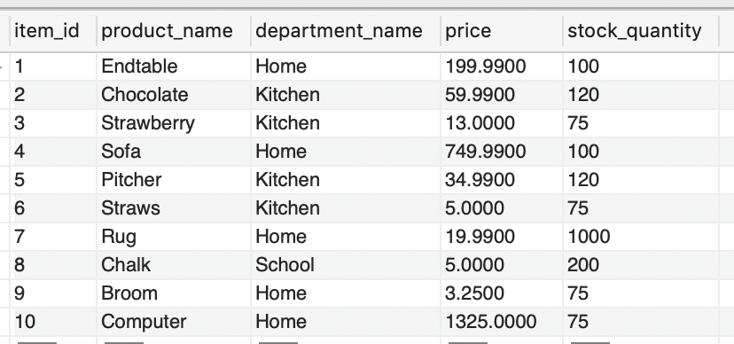
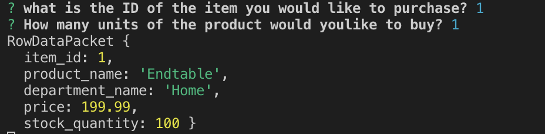
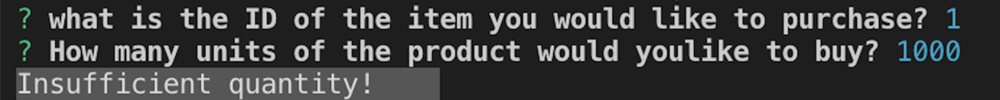

# Bamazon.app

#### A repository loosely based on a client's experience buying online.

## Overview

An online storefront with the MySQL and Node.js. The app takes in orders from customers and depletes stock from the store's inventory.

### Github Repository

* https://github.com/QuietEvolver/Bamazon.git

### MySQL Database called `bamazon`.

Populates database with around 10 different products for "mock" data rows into database/table.

Running this application displays all of the items available for sale.

The app then prompts users with two messages:
   * The first should ask them the ID of the product they would like to buy.
   * The second message should ask how many units of the product they would like to buy.

After which, the application checks if store has enough product to meet the customer's request; if not, the app should logs `Insufficient quantity!`.

## Specification/Requirements
<pre>
1. Clone this repository: https://github.com/QuietEvolver/Bamazon and/or https://quietevolver.github.io/Bamazon/
2. Open the command line--and navigate into the repository.
  - Install: 
      $ npm install -y
      $ npm install mysql

3. On your browser, open the desired file, and enjoy!
</pre>
## Known Bugs
<pre>
* Work in progress.
</pre>
## Technologies Used
<pre>
* Visual Studio Code
* Markdown
* SQL
* CSS
* GitHub
</pre>
### License

*This software is licensed under the MIT license*

Copyright (c) 2019 **By _Vera Weikel_**
